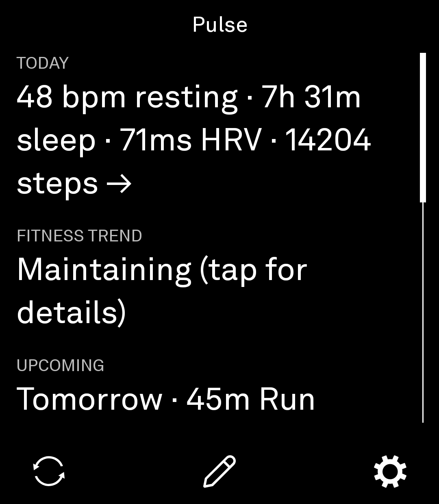
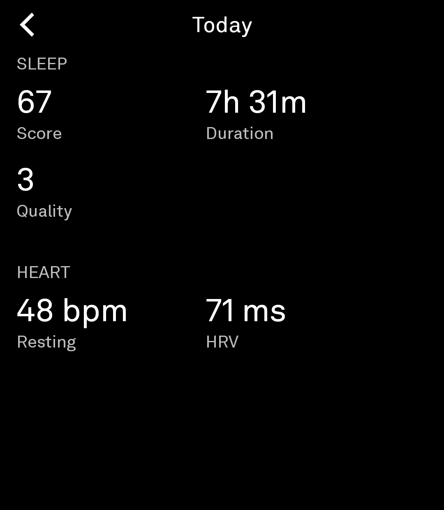
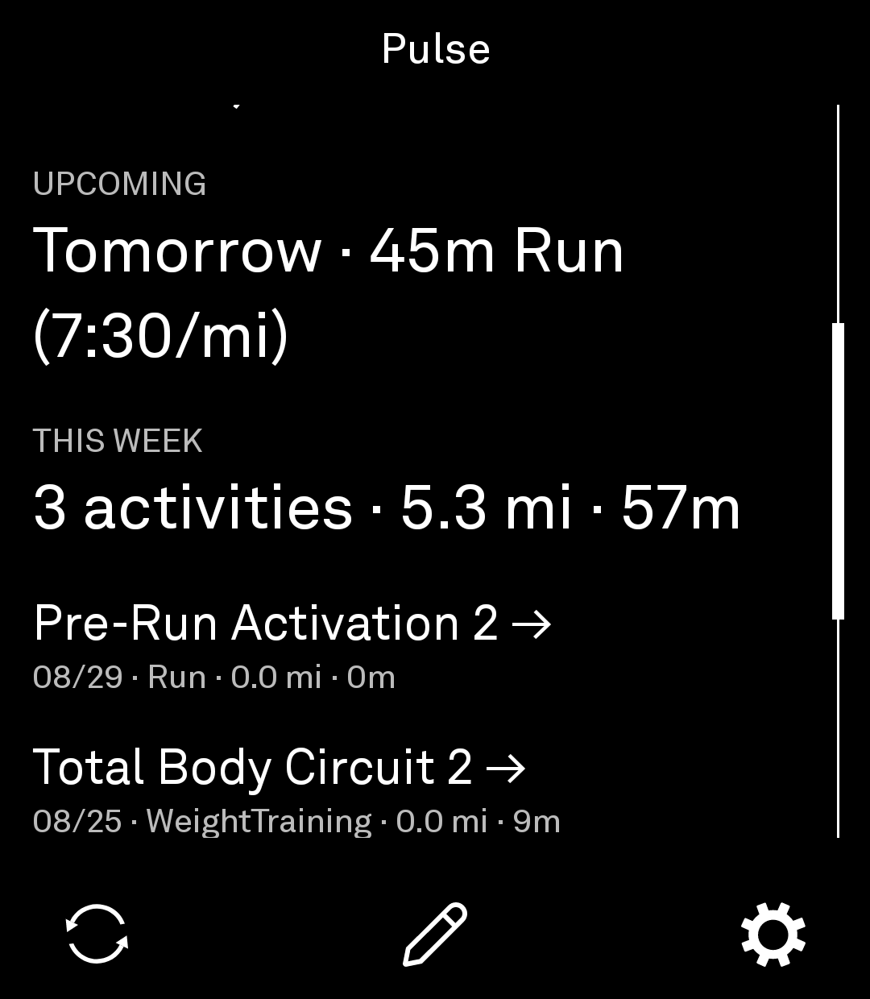
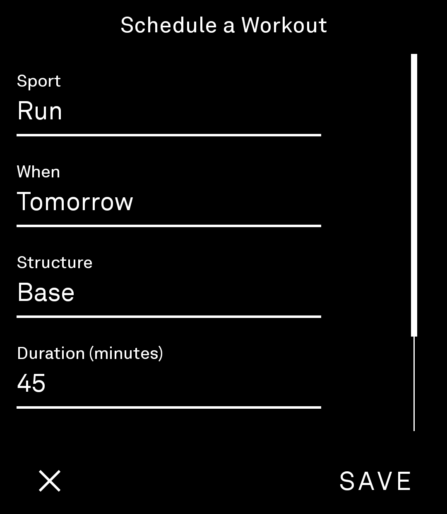
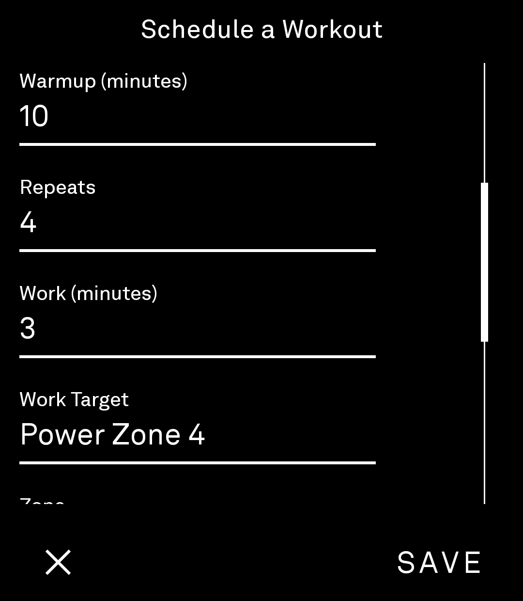
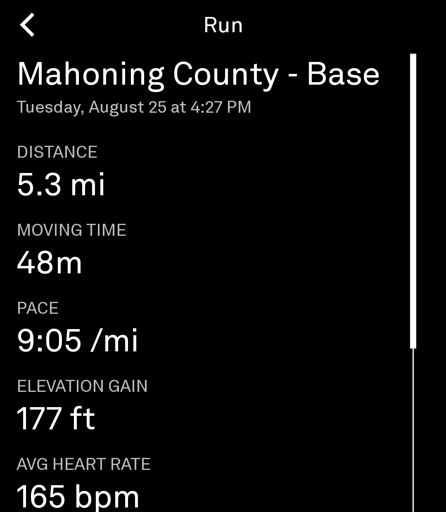

# Pulse

Shows your recent activities and today's wellness snapshot (resting heart rate, sleep, HRV,
steps) on your Light Phone, pulled from [intervals.icu](https://intervals.icu).

This is a **personal-use** tool: it's built around your own free intervals.icu API key. See
"Why this instead of Strava or Garmin directly" below for why.

## Screenshots

| Home | Today detail | Activities |
| --- | --- | --- |
|  |  |  |

| Schedule a Workout | Interval builder | Activity detail |
| --- | --- | --- |
|  |  |  |

There are two parts to getting this running: **getting the app onto your Light Phone**
(this section - it needs a computer and a few typed commands, there's no way around that for
now) and **connecting your intervals.icu account** (the "Connecting Your Account" section below
- that part is just tapping on the phone itself).

## Installing Pulse

This whole section is a one-time setup. Budget about 30-45 minutes, most of which is just
waiting for downloads. You don't need to understand what any of these tools do - just follow
the steps in order and copy-paste the commands exactly as written.

**What you'll need:** a Mac or Windows computer, your Light Phone III, a USB cable that connects
the two, and a wifi connection.

> These instructions are written for **macOS**. If you're on Windows, the same five parts apply
> - install Android Studio, install Git, download this code, build it, turn on your phone's
> developer settings, plug it in and install - just using Windows' own installers and Command
> Prompt instead of Terminal. The exact commands differ slightly; search "[step name] on
> Windows" if you get stuck, or ask a tech-comfortable friend to walk through this one section
> with you.

### Part 1: Install Android Studio (one-time)

This is the program that knows how to turn this project's code into an app. You won't actually
use it directly - installing it is just how your computer gets the pieces it needs.

1. Go to <https://developer.android.com/studio> and click the big **Download Android Studio**
   button. Accept the terms when asked.
2. Once it's downloaded, open the file and drag Android Studio into your Applications folder,
   the way you would with any other Mac app.
3. Open Android Studio (Applications folder, or search for it with Spotlight - Cmd+Space, then
   type "Android Studio"). The first time it opens, it'll offer to run a **Setup Wizard**. Click
   through it, keeping every default option ("Standard" install type is correct). This step
   downloads a few gigabytes of files, so it may take a while depending on your internet speed.
4. When it's done and you see Android Studio's main "Welcome" screen, you're finished with this
   part. You can quit Android Studio - you won't need to open it again for this.

### Part 2: Get Terminal ready

Terminal is an app already on your Mac for typing commands. You'll only need three commands
total in this whole guide, all provided below to copy-paste.

1. Open Terminal: press Cmd+Space, type "Terminal", press Enter.
2. Copy and paste this, then press Enter:

   ```bash
   git --version
   ```

   If a window pops up asking to install "Command Line Developer Tools," click **Install**,
   agree to the license, and wait for it to finish (a few minutes). If instead it just prints
   something like `git version 2.4x.x`, you already have it - move on.

### Part 3: Download this project

Still in Terminal, copy-paste each of these one at a time, pressing Enter after each and
waiting for it to finish before pasting the next:

```bash
cd ~/Desktop
git clone -b add-kagi-news-tool https://github.com/Zarrasko/light-sdk.git
cd light-sdk
```

This creates a folder called `light-sdk` on your Desktop and moves Terminal "into" it. Every
command in the rest of this guide assumes Terminal is still in that folder - if you close and
reopen Terminal later, run `cd ~/Desktop/light-sdk` again first.

### Part 4: Tell the project where Android Studio put its tools

1. Open Android Studio one more time. On the Welcome screen, click **More Actions** (or the
   gear/settings icon) → **SDK Manager**.
2. Near the top of that window, there's a line labeled **Android SDK Location** with a file path
   next to it (usually `/Users/yourname/Library/Android/sdk`). Copy that whole path.
3. Back in Terminal (still in the `light-sdk` folder), copy-paste this to create the file and
   open it in TextEdit, the plain text editor already on your Mac:

   ```bash
   touch local.properties && open -e local.properties
   ```

4. A blank window opens. Type this one line into it, replacing the path with the one you copied
   in step 2:

   ```text
   sdk.dir=/Users/yourname/Library/Android/sdk
   ```

5. Save and close (Cmd+S, then close the window).

### Part 5: Build the app

Back in Terminal, in the `light-sdk` folder, copy-paste:

```bash
./gradlew :examples:pulse:assembleDebug
```

The first time you run this, it downloads more files and can take several minutes - that's
normal. You'll know it worked when you see `BUILD SUCCESSFUL` near the bottom. If you see `BUILD
FAILED` instead, the most common cause is Part 4 - double check the path you pasted into
`local.properties` is exactly what Android Studio showed you, with no extra spaces or line
breaks.

### Part 6: Turn on your phone's developer settings

This only needs to be done once per phone, and it's what allows a phone to install an app
directly from a computer instead of an app store.

1. On your Light Phone III: **Settings → About Phone** (exact wording may vary slightly).
2. Find **Build Number** and tap it **seven times in a row**. You'll see a message count down
   ("You are now 3 steps away from being a developer," etc.) and eventually "You are now a
   developer!"
3. Go back to the main Settings screen. A new option called **Developer Options** will now
   appear. Open it.
4. Turn on **USB Debugging** (near the top of that list).

### Part 7: Connect and install

1. Plug your Light Phone into your computer with the USB cable.
2. Your phone screen will show a popup asking to allow USB debugging from this computer.
   **Check "always allow from this computer"** and tap **Allow**.
3. Back in Terminal, copy-paste:

   ```bash
   ./gradlew :examples:pulse:installDebug
   ```

4. When it says `BUILD SUCCESSFUL` / `Installed on 1 device`, Pulse is now on your phone. Find
   it in your Light Phone's app list and open it.

You're done with the computer part. Everything from here happens on the phone - see
"Connecting Your Account" below.

**Updating later:** if you pull newer code for this tool, you only need Part 5 and Part 7 again
- Parts 1-4 and 6 are one-time setup for this computer and phone.

## Connecting Your Account

### 1. Create a free intervals.icu account

Go to <https://intervals.icu> and sign up - no credit card, no subscription. If you have a
Garmin, Coros, Wahoo, Polar, or similar watch, connect it once from intervals.icu's own
Settings page (they hold an official partnership with Garmin, so this isn't the unofficial
reverse-engineered kind of integration). Activities and wellness data sync automatically after
that.

### 2. Get your API key

In intervals.icu, go to Settings → Developer Settings, and generate an API key. That's the
entire auth setup - no OAuth, no browser redirect, no expiring tokens to refresh.

### 3. Get the key into the tool

**Option A - type it in.** Open the tool, tap the API Key field under "Connect Pulse," and
enter it.

**Option B - scan a QR code.** Faster for a long key. Generate the QR code **entirely
offline** - never paste your key into a web-based QR generator, since that sends it to a third
party. This repo includes a small local script:

```bash
pip install "qrcode[pil]"
python3 examples/pulse/scripts/generate_qr.py
```

Open the resulting PNG on your computer screen, tap the camera icon in the tool, and scan it.
Delete the PNG afterward - it's a plaintext copy of your key.

## About the name

Named **Pulse** rather than after its data source (intervals.icu) because "Intervals" describes
one kind of workout, not what this tool actually shows - activities, wellness, and a fitness
trend together. Pulse works two ways at once: literally, as a vital sign (the resting heart
rate, HRV, and sleep this tool surfaces), and idiomatically, as in "keeping a pulse on"
something - a fitting name for a glance-and-go summary rather than a single metric.

## Why this instead of Strava or Garmin directly

- **Garmin** has no personal-use developer API at all - the unofficial libraries that exist
  work by reverse-engineering Garmin's mobile login flow, and that flow broke hard in 2026 in
  ways the ecosystem is still fighting to patch around.
- **Strava** now requires an active paid subscription (~$12/month) for developer API access as
  of mid-2026, on top of only ever exposing workout data, not wellness.
- **intervals.icu** is free, holds an official Garmin Health/Training API partnership (so
  Garmin's side of this is already solved, by them, the sanctioned way), and its own API needs
  nothing more than a static key over HTTP Basic auth - no browser or redirect required, which
  matters because Light Phone Tools can't launch a browser or receive one back in the first
  place.
